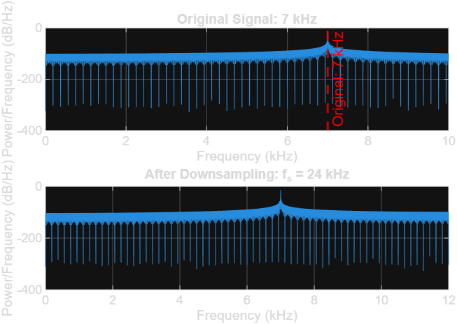
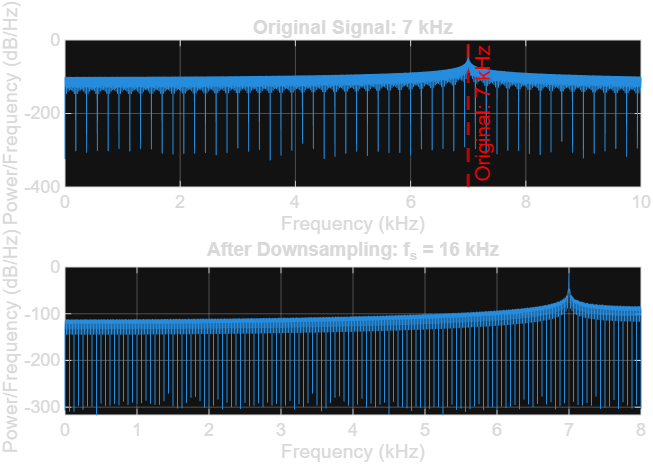
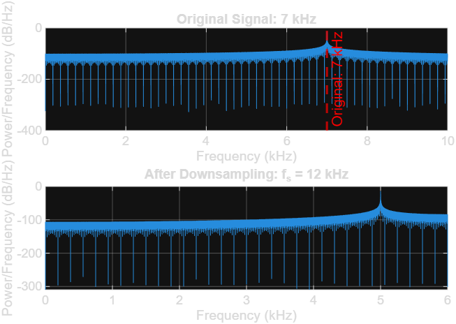
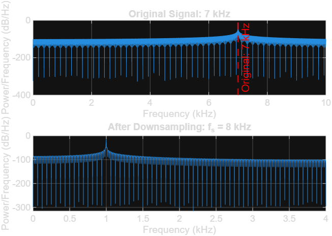

# Lecture 02 – In-Class Assignment: Audio Sampling and Aliasing

## Purpose

The purpose of this experiment was to investigate how sampling frequency affects a 7 kHz audio signal.

The original signal was sampled at 24 kHz, 16 kHz, 12 kHz, and 8 kHz. The frequency spectra and audio were compared to observe when aliasing occurred.

According to the Nyquist Sampling Theorem:

fs >= 2 × fmax

For a 7 kHz signal:

fs >= 2 × 7 kHz

fs >= 14 kHz

Therefore, the sampling frequency should be at least 14 kHz to represent the 7 kHz signal correctly.

---

## Results

| Sampling Frequency | Nyquist Frequency | Observed Peak | Aliasing |
|---|---|---|---|
| 24 kHz | 12 kHz | 7 kHz | No |
| 16 kHz | 8 kHz | 7 kHz | No |
| 12 kHz | 6 kHz | 5 kHz | Yes |
| 8 kHz | 4 kHz | 1 kHz | Yes |

---

## Spectrum Figures

### Sampling at 24 kHz

The Nyquist frequency is 12 kHz, which is higher than the 7 kHz signal. The signal is therefore represented correctly.

### Sampling at 16 kHz

The Nyquist frequency is 8 kHz. Since the original signal is 7 kHz, it is still below the Nyquist frequency and no aliasing occurs.

### Sampling at 12 kHz

The Nyquist frequency is only 6 kHz. The original 7 kHz signal is above this limit, so aliasing occurs.

The 7 kHz signal appears as approximately 5 kHz.

### Sampling at 8 kHz

The Nyquist frequency is 4 kHz. Since the 7 kHz signal is above the Nyquist frequency, strong aliasing occurs.

The 7 kHz signal appears as approximately 1 kHz.

---

## Questions

### 1. Which sampling frequencies represented the 7 kHz signal correctly?

The **24 kHz and 16 kHz** sampling frequencies represented the 7 kHz signal correctly.

Both sampling frequencies have Nyquist frequencies greater than 7 kHz.

---

### 2. When did the 7 kHz signal appear as another frequency?

The signal appeared as another frequency when sampling at **12 kHz and 8 kHz**.

- At 12 kHz sampling, the 7 kHz signal appeared as approximately **5 kHz**.
- At 8 kHz sampling, the 7 kHz signal appeared as approximately **1 kHz**.

This is caused by aliasing.

---

### 3. What happened when the Nyquist frequency became lower than 7 kHz?

When the Nyquist frequency became lower than 7 kHz, the sampled signal could no longer correctly represent the original frequency.

The frequency folded into the valid frequency range and appeared as a lower frequency. This effect is called **aliasing**.

---

### 4. Did the aliased signal sound different?

Yes.

The aliased signals sounded lower in pitch because MATLAB reproduced the aliased frequencies instead of the original 7 kHz frequency.

The 12 kHz sampling case produced approximately a 5 kHz tone, while the 8 kHz sampling case produced approximately a 1 kHz tone.

---

### 5. Why can MATLAB not recover the original 7 kHz signal after aliasing?

After aliasing occurs, the sampled data no longer contains enough information to uniquely identify the original frequency.

For example, after sampling at 8 kHz, the samples make the original 7 kHz signal appear as a 1 kHz signal.

MATLAB only has access to the sampled values, so it cannot determine whether those samples originally came from 1 kHz, 7 kHz, or another frequency that produces the same sampled pattern.

This is why aliasing should be prevented before sampling by using a sufficiently high sampling frequency and, in practical systems, an anti-aliasing filter.

---

## Conclusion

The experiment demonstrated that the sampling frequency must be sufficiently high to correctly represent an analog signal.

For the 7 kHz signal, the minimum Nyquist sampling rate is:

fs >= 14 kHz

Therefore:

- **24 kHz** → correct representation
- **16 kHz** → correct representation
- **12 kHz** → aliasing to 5 kHz
- **8 kHz** → aliasing to 1 kHz

The experiment shows why selecting an appropriate sampling frequency is important in digital signal processing.
