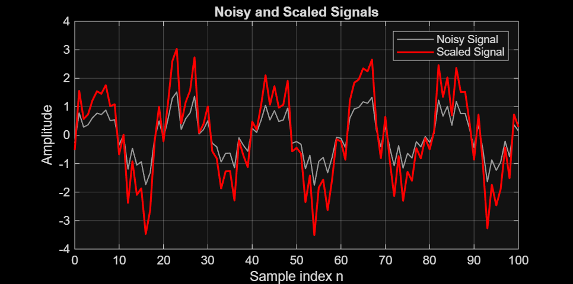
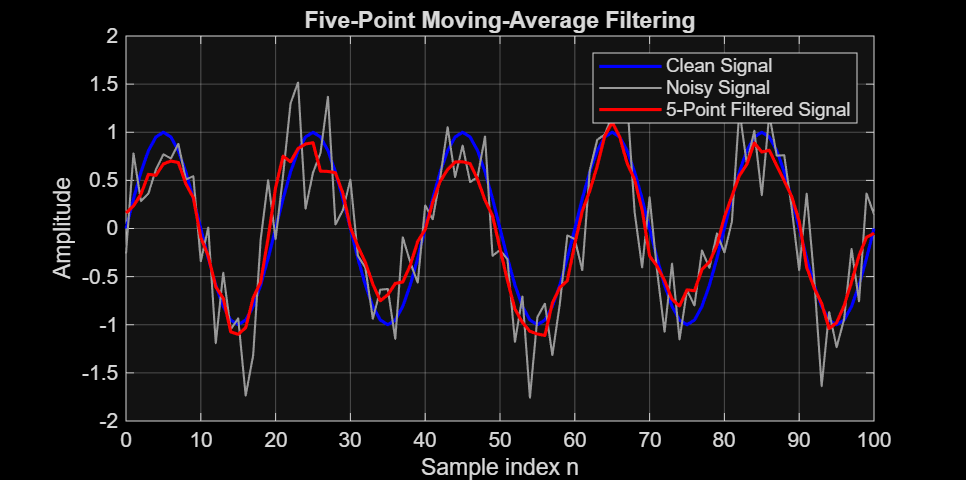
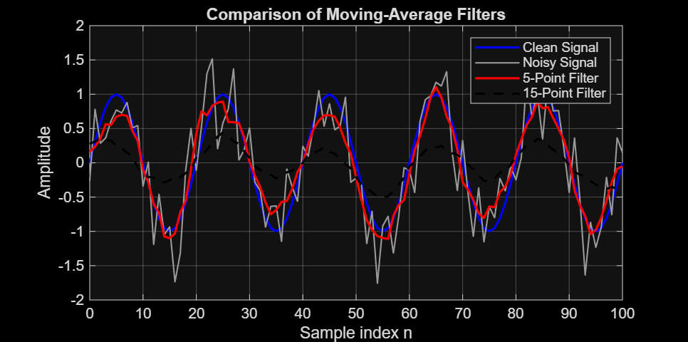

# Lecture 03 - Convolution and Moving-Average Filtering

## Overview

In this assignment, a discrete-time sine signal was created in MATLAB. Noise was added to the signal, and different signal-processing operations were applied.

The assignment demonstrates amplitude scaling, signal delay, convolution, and moving-average filtering.

---

## Task 1: Amplitude Scaling

The noisy signal was multiplied by 2.

    scaled = 2 * measured;

This doubled the amplitude of the noisy signal. The frequency and sample positions did not change.

---

## Task 2: Signal Delay

The noisy signal was delayed by 5 samples.

    delay = 5;
    delayed = [zeros(1, delay), measured];

Five zeros were added before the original signal. This shifted the signal to the right by 5 samples.

The shape of the signal remained the same, but it started later.

In a real system, a delay can be caused by signal processing time, communication, or transmission through a physical system.

---

## Task 3: Five-Point Moving-Average Filter

A five-point moving-average filter was created using:

    h5 = ones(1,5)/5;

The filter was applied using convolution:

    filtered5 = conv(measured,h5,'same');

The filter averages nearby samples, which reduces rapid variations caused by noise.

---

## Task 4: Comparison of Filter Lengths

A 15-point moving-average filter was created:

    h15 = ones(1,15)/15;

It was then applied using convolution:

    filtered15 = conv(measured,h15,'same');

The 15-point filter produced stronger smoothing than the 5-point filter.

---

# Questions

## 1. Which operation changed the signal amplitude?

Amplitude scaling changed the signal amplitude. Multiplying the noisy signal by 2 doubled its amplitude values.

## 2. How did the five-sample delay change the signal?

The signal was shifted to the right by 5 samples. Five zeros were added before the original signal, so the signal started later.

## 3. What does the impulse response h[n] represent?

The impulse response describes how a filter responds to an impulse input. It contains the coefficients used by the filter to process the input signal.

## 4. How did convolution change the noisy signal?

Convolution combined the noisy signal with the filter coefficients. It averaged nearby samples and reduced rapid variations caused by noise.

## 5. What differences did you observe between the 5-point and 15-point filters?

The 5-point filter produced moderate smoothing while keeping the original signal shape relatively clear.

The 15-point filter produced stronger smoothing and removed more rapid variations.

## 6. Which filter removed more noise?

The 15-point filter removed more rapid noise because it averages over more samples.

## 7. Did the longer filter remove or distort useful signal information?

The longer filter can remove some useful signal information because it averages a larger number of samples. This can make the signal smoother and reduce some of its details.

## 8. Which filter would you recommend for this signal? Explain your decision.

For this signal, the 5-point filter is suitable because it reduces noise while preserving more of the original sine-wave shape.

The 15-point filter provides stronger smoothing but changes the signal more.

## 9. Give one real engineering application for moving-average filtering.

A moving-average filter can be used to reduce noise in sensor measurements. For example, temperature or pressure readings from an IoT sensor can be smoothed before being displayed or processed.

---

# AI Usage

## Tool used

ChatGPT

## How I used it

I used AI to help understand the MATLAB assignment, complete the MATLAB code, and explain the signal-processing operations.

## What I verified or changed

I ran the MATLAB code and checked that the script executed without errors and that the required figures were generated.
